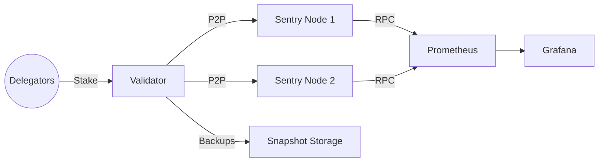
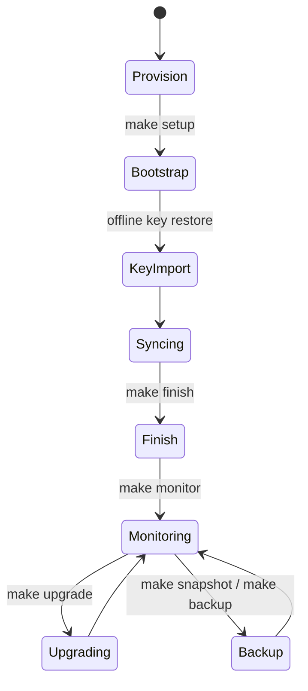

# Q-Sync Qubetics Validator Starter

[](https://github.com/Qubetics/qubetics-validator-starter/actions/workflows/full-ci.yml)
[](https://github.com/Qubetics/qubetics-validator-starter/actions/workflows/security-scan.yml)
[](LICENSE)
[](CHANGELOG.md)
[](https://qubetics.community/support)

Production-ready automation scripts, infrastructure templates, and monitoring tooling for operating a Qubetics validator with security and observability baked in.



## Features

- Hardened two-phase bootstrap (`make setup`, `make finish`) with environment validation, configurable ports, and audit trails.
- RPC management (`scripts/rpc.sh`) covering localhost lock-down, TLS exposure with allow-lists, and instant revoke.
- Operational scripts for snapshots, restores, upgrades, backups, log analysis, tuning, benchmarking, and health monitoring.
- Prometheus exporter + Grafana dashboard plus Slack/Discord/Telegram alerting through `scripts/monitor.sh`.
- Docker Compose profiles (single + HA), Terraform and Ansible automation, pre-commit hooks, and GitHub Actions pipelines.
- Extensive documentation (`docs/`) including deployment, monitoring, security best practices, FAQs, and community outreach playbooks.
- Log rotation example (`config/logrotate.d/qubetics`) and auditd rules baked into hardening script.

## Prerequisites

- Ubuntu 20.04/22.04 server or compatible cloud VM (8 vCPU / 32GB RAM / 1TB NVMe recommended).
- 25,000+ TICS self-delegation funds and offline key management workflow.
- DNS records and TLS-capable domain if exposing RPC.
- Optional: Slack/Discord/Telegram webhooks for alerting.

## Quick start

```bash
# Clone repository
git clone https://github.com/Qubetics/qubetics-validator-starter.git
cd qubetics-validator-starter

# Configure environment
cp config.sample.env .env
$EDITOR .env

# Phase 1 – bootstrap and harden (run as root)
make setup MONIKER=NovaOS-1

# Import validator key OFFLINE, then place files in $HOME_DIR/config

# Phase 2 – final validation once fully synced
make finish

# Lock RPC to localhost (default)
make rpc-local

# Optional: expose TLS RPC behind allow-list and automatic certificates
make rpc-domain DOMAIN=rpc.example.com ALLOW_IPS=1.2.3.4,5.6.7.8 EMAIL=ops@example.com

# Run health monitor and send alerts
make monitor RPC=http://127.0.0.1:26657 REFERENCE_RPC=https://rpc.qubetics.org
```

## Environment configuration

All scripts load `.env` automatically. Key variables (see `config.sample.env` for full list):

| Variable | Description |
| --- | --- |
| `NETWORK_PROFILE` | `mainnet` or `testnet` (affects bootstrap branch selection). |
| `CHAIN_ID` | Chain identifier, e.g. `qubetics-1`. |
| `MIN_TICS` | Minimum self-delegation enforced by `finish.sh`. |
| `RPC_PORT`, `P2P_PORT`, `GRPC_PORT`, `API_PORT` | Port assignments for node services. |
| `BLOCK_LAG_THRESHOLD`, `PEER_MINIMUM`, `DISK_WARN_GB` | Monitoring thresholds. |
| `SLACK_WEBHOOK_URL`, `DISCORD_WEBHOOK_URL`, `TELEGRAM_BOT_TOKEN`, `TELEGRAM_CHAT_ID` | Alerting endpoints. |
| `BACKUP_DIR`, `SNAPSHOT_DIR`, `BACKUP_PASSPHRASE` | Backup/snapshot storage configuration. |

## Operational runbook

| Task | Command |
| --- | --- |
| Create snapshot | `make snapshot` |
| Restore snapshot | `make snapshot-restore SNAP_URL=https://...` |
| Encrypted backup | `make backup BACKUP_PASSPHRASE=secret` |
| Tune OS parameters | `sudo make tune` |
| Benchmark host | `make benchmark DURATION=15` |
| Analyze logs | `make analyze-logs SINCE="12 hours ago"` |
| Monitor + alerts | `make monitor` |
| CLI status | `tools/qubeticsctl.py status --rpc http://127.0.0.1:26657` |

Outputs land in `.reports/` for compliance and review.

## Monitoring & alerting

- Prometheus exporter: `make exporter` or run via `docker/docker-compose.ha.yml`.
- Grafana dashboard template: `docs/diagrams/grafana-dashboard.json`.
- Cron automation examples: see `docs/monitoring.md`.
- `scripts/monitor.sh` emits JSON at `.reports/monitor.json` and posts alerts to configured channels.

## Backups & recovery

1. Schedule `make snapshot` (creates compressed archive with retention).
2. Schedule `make backup BACKUP_PASSPHRASE=...` (encrypted archive of keys/config).
3. Test recovery with `make snapshot-restore SNAP_URL=<local file://...>` on staging hosts.
4. Document your backup rotation in `TODO.md` and share procedures with your team.

## Docker & infrastructure automation

- `docker/docker-compose.single.yml` for standalone deployments.
- `docker/docker-compose.ha.yml` for validator + sentry + exporter.
- Terraform (`infra/terraform`) provisions AWS infrastructure with security groups and user-data bootstrap.
- Ansible (`infra/ansible`) installs Docker and boots the HA compose stack.

## Validator lifecycle



1. Provision host(s) and run `make setup`.
2. Import keys offline and verify state.
3. Complete `make finish` once synced and funded.
4. Monitor, alert, and back up continuously.
5. Use `make upgrade` / `make snapshot-restore` for planned upgrades.
6. Engage community using guidance in `docs/community.md`.

## Documentation

- [Deployment guide](docs/deployment.md)
- [Security guide](docs/security.md)
- [Monitoring guide](docs/monitoring.md)
- [FAQ](docs/faq.md)
- [Community outreach](docs/community.md)

## Testing

Run the provided linters and smoke tests before submitting changes:

```bash
pre-commit run --all-files
bats tests
```

Install [`pre-commit`](https://pre-commit.com/) and [`bats`](https://bats-core.readthedocs.io/) locally.
Alternatively, run `make ci` to bootstrap both tools inside a disposable container.

## Support & contributions

- Open issues using the template in `.github/ISSUE_TEMPLATE.md`.
- Follow [CONTRIBUTING.md](CONTRIBUTING.md) for commit and testing standards (pre-commit hooks, Bats tests).
- Security incidents: contact [security@qubetics.org](mailto:security@qubetics.org).
- Donations: `qubetics1donationxxxxxxxxxxxxxxxxxx` (thank you for supporting validator operations!).

## License

Licensed under the [Apache 2.0 License](LICENSE).
